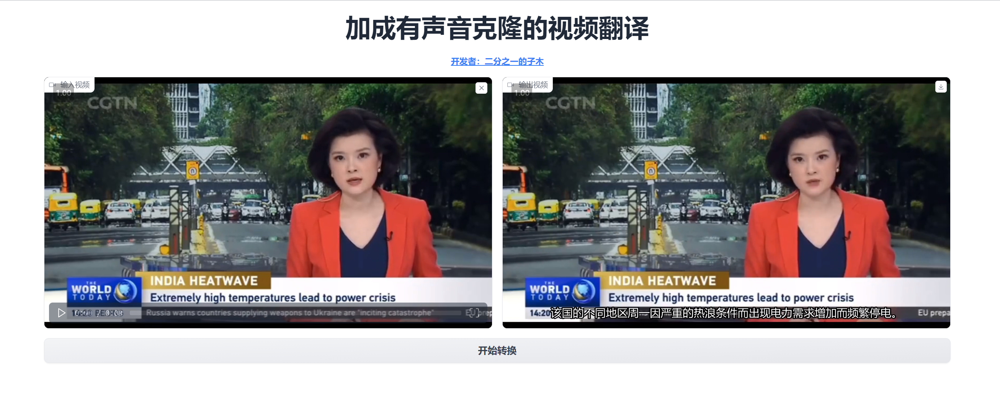

# 带有语音克隆功能的视频翻译
转录视频语音并翻译，语音克隆，压制字幕，支持中英视频互相转换


## 效果演示

还是放个视频吧，这样效果会好一点

## 环境搭建
1. 安装[ffmpeg](https://ffmpeg.org/)并添加到环境变量，或者是直接把相应可执行程序放到当前目录ffmpeg文件夹
```
ffmpeg
   |- ffmpeg.exe
   |- ffprobe.exe
...
```

2. 安装依赖
```
git clone

conda create -n v2vt_clone python=3.11.0
conda activate v2vt_clone

cd v2vt_clone
pip install -r requirements.txt
pip install torch torchvision torchaudio --index-url https://download.pytorch.org/whl/cu118
```
3. 把openvoice中需要的[模型](https://myshell-public-repo-hosting.s3.amazonaws.com/checkpoints_1226.zip)放到`openvoice_checkpoints`文件夹中，目录结构应该如下
```
openvoice_checkpoints
   |- base_speakers
    |- ...
   |- converter
    |- ...
...
```


## 使用说明
- 快速启动
```
python app.py
```
- 关于输入  
输入视频不能太短，否则语音克隆的时候报错（最好不要低于8S）

- 关于输出  
默认是输出到当前目录下的output.mp4，也可以在webui中直接下载


## TODO
- [ ] 人声分离：提升whisper输入的音频质量([spleeter](https://github.com/deezer/spleeter))  
- [ ] 音频降噪：音色克隆后的声音电噪明显  
- [ ] 口型同步：提升画面的自然度([videoretalking](https://github.com/OpenTalker/video-retalking))  


## 参考项目
- 语音识别 [fast-whisper](https://github.com/SYSTRAN/faster-whisper)
- 文本翻译 [facebook/m2m](https://huggingface.co/facebook/m2m100_1.2B)
- 音色克隆 [openvoice](https://github.com/myshell-ai/OpenVoice)（对于中文，使用微软的[TTS](https://github.com/skygongque/tts)替换openvoice自带的TTS模型）
- 音频整合 [pyvideotrans](https://github.com/jianchang512/pyvideotrans)


## 其它
licence和code_of_conduct和[video-retalking](https://github.com/OpenTalker/video-retalking)项目一致  
详见LICENSE和CODE_OF_CONDUCT
